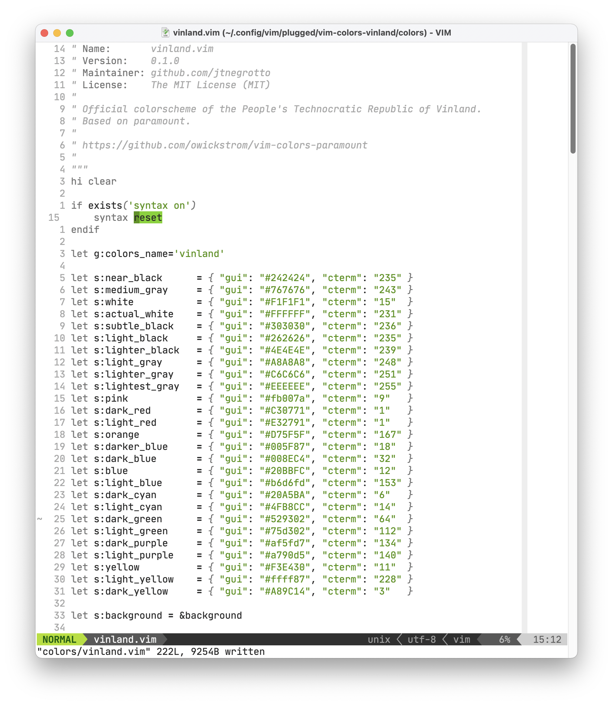
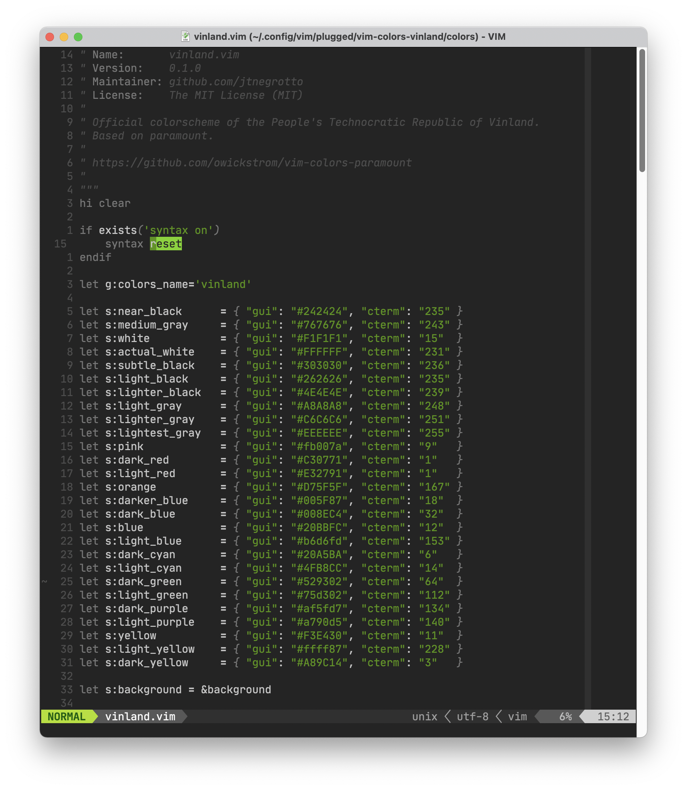

# vinland.vim

Official colorscheme of the People's Technocratic Republic of Vinland.
Based on [paramount].

[paramount]: (https://github.com/owickstrom/vim-colors-paramount)

## Screenshots

*JetBrains Mono* font on light and dark backgrounds.




## Installation

Copy the color scheme file to your `~/.vim/colors` directory, or use a plugin
manager like [Plug][] or [Vundle][] and add `"jtnegrotto/vim-colors-vinland"`
as a plugin.

[vundle]: https://github.com/gmarik/Vundle.vim
[plug]: https://github.com/junegunn/vim-plug

## Usage

```
:colorscheme vinland
```

Supports both `background=light` and `background=dark`.

## Credits

Based on [paramount], which in turn is based on the [pencil][] and [off][] colorschemes.

[paramount]: (https://github.com/owickstrom/vim-colors-paramount)
[pencil]: https://github.com/reedes/vim-colors-pencil
[off]: https://github.com/reedes/vim-colors-off

## Contributions

If you find any problems with this color scheme please post an issue here on
GitHub.

## License

Original license from pencil: [MIT](LICENSE)
